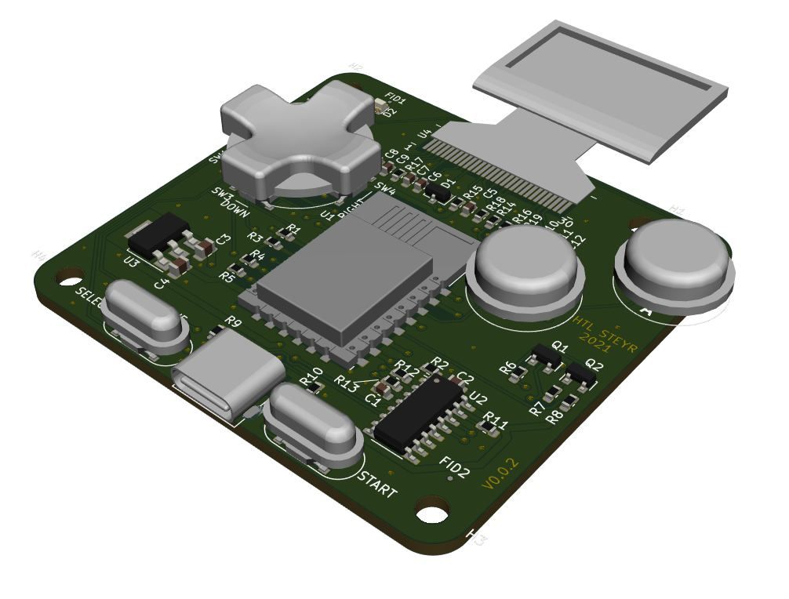

# Gamearino

Elektronisches Spielgerät mit 
* Gameboy Tastenlayout
* OLED-Display mit 128x64 Pixel
* Controller: ESP8266EX (Modul ESP-12F)

# OLED
wurde getestet mit dem Arduino Nano mit der Adafruit-Lib. Weil wir keinen Reset-Pin haben, 
muss das Display etwas anders initialisiert werden: 
''display.begin(SSD1306_SWITCHCAPVCC, 0x3c, false);''

Die I2C-Adresse jedenfalls ist 0x3c anstatt 0x3d (Default aus Example Code). 

# Arduino IDE
* ESP8266 installieren: 
  http://arduino.esp8266.com/stable/package_esp8266com_index.json
* Adafruit SSD1306 Lib: 
  Achtung: I2C-Adresse auf 0x3c:
  #define SCREEN_ADDRESS 0x3c

  I2C-Schnittstelle auf GPIO2 und GPIO14 festlegen:
  Wire.begin(14,2); // SDA, SCL
  
# Spiele
Für diese Plattform gibt es zwei Sorten von Spielen: 
1. HTL-Spiele: Spiele von Schülern entwickelt, befindens sich in diesem Repository im Ordner "arduino": https://github.com/KarlZeilhofer/gamearino/tree/main/arduino
2. Arduboy2: Spiele von Profis programmiert. Das originale Repository wurde um die Hardwareportierung erweitert und befindet sich hier: https://github.com/KarlZeilhofer/esp8266_arduboy2

## HTL-Spiele
Für die HTL-Spiele werden folgende Bibliotheken benötigt:
* Adafruit_BusIO
* Adafruit_GFX_Library
* Adafruit_SSD1306
* ESP_EEPROM

## Arduboy Spiele
Für die Arduboy-Spiele braucht es das zweite Repository: https://github.com/KarlZeilhofer/esp8266_arduboy2 und die zugehörigen Bibliotheken, siehe README.md dort. 

# Links
* Arduino ES8266 Core Dokumentation: https://arduino-esp8266.readthedocs.io/en/latest/
* Wikipedia: https://en.wikipedia.org/wiki/ESP8266
* OLED I2C vs. SPI on Youtube: https://www.youtube.com/watch?v=Wz6Fzo3rsLM
* https://www.heise.de/ct/artikel/Arduino-IDE-installieren-und-fit-machen-fuer-ESP8266-und-ESP32-4130814.html
* http://stefanfrings.de/esp8266/
* Adafruit Graphics Library Documentation: https://learn.adafruit.com/adafruit-gfx-graphics-library/overview

